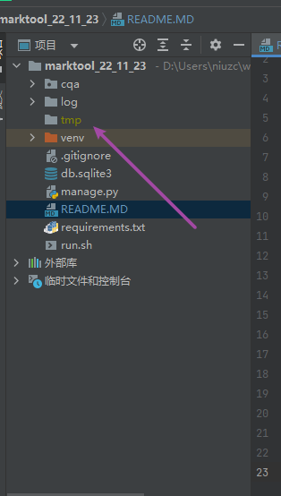

## 本项目后端开发框架是Django，前端开发框架是Vue，组件使用element-ui，前端服务器是nginx

后端启动方法  
`见根目录run.sh`  
详解：
1. 第一步是导入必要的环境变量
2. 第二步是启动环境，"niuzc"已经搭建好了标注工具的环境
3. 第三步是执行启动标注工具后端的命令

数据库重启方法  
`service mysqld restart`

FileNotFoundError: [Errno 2] No such file or directory: 'tmp\\paediatrics42_name_2000_1043增补.multiclassification'
说明缺少tmp文件夹

新建一个tmp的文件夹就可以了